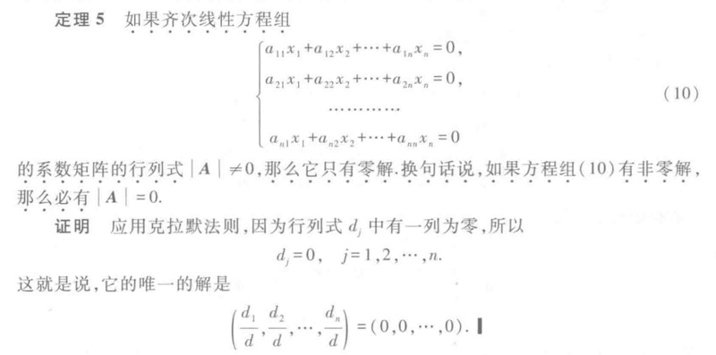

# Gemini-LaTeXOCR

An intelligent OCR tool based on Google Gemini, automatically recognizing mathematical formulas from the clipboard and generating precise LaTeX/Markdown code to facilitate efficient academic note-taking.

---

## 📖 Introduction

To address the inefficiency of converting complex mathematical formulas and mixed text into LaTeX code, this tool is developed using the **Gemini-2.0-flash** model. Key advantages include:
- **Real-time Clipboard Monitoring**: Automatically recognizes screenshots (toggleable) without manual intervention.
- **High Accuracy**: Optimized for complex structures like matrices, equations, and formulas.
- **Cross-Format Compatibility**: Output code supports `.tex` and `.md`, ready for one-click copying.

⚠️ **Note**:  
- **Windows only**. Requires a stable internet connection to access Gemini API.
- A free API Key from Google AI Studio is required ([see setup guide](#-installation--configuration)).

---

## 🚀 Features

- **Automated Workflow**: Clipboard image detection → auto-compression → API call → code generation.
- **Dual Input Modes**: Supports clipboard recognition and manual image upload (PNG/JPG).
- **Smart Formatting**: Optimized code structure for academic writing.
- **Lightweight**: Packaged with Nuitka (~3s startup time).

---

## 🔧 Installation & Configuration

### Step 1: Obtain API Key
1. Visit [Google AI Studio](https://ai.google.dev/) and log in with your Google account.
2. Click "Create API Key" and generate your key.
3. Copy the generated API Key.  


### Step 2: Run the Program
1. Download and run `Gemini-LaTeXOCR.exe`.
2. **First Launch**: Paste your API Key into the input field → Click "Save".
3. Restart the program. Clipboard monitoring is enabled by default (toggle via gear icon).

---

## 🖥 Usage

### Mode 1: Clipboard Recognition (Recommended)
1. Capture the formula/text area using a screenshot tool (e.g., Snipaste).
2. Copy the image to clipboard (`Ctrl+C`).
3. The program auto-detects and generates code, displayed in the main interface.
4. Click "Copy Result" to paste directly into your document.

### Mode 2: Manual Upload
1. Click "Select File" to upload a local image.
2. Wait for recognition. Results are displayed and ready to copy.

### Settings
- **Clipboard Monitoring**: Toggle via the gear icon.
- **Temporary File Cleanup**: Cache images are automatically deleted after recognition.

---

## 🔍 Example

**Input Image**:  


**Output Code**:
```latex
Theorem 5 If the homogeneous linear system
$$
\begin{cases}
a_{11}x_1 + a_{12}x_2 + \dots + a_{1n}x_n = 0, \\
a_{21}x_1 + a_{22}x_2 + \dots + a_{2n}x_n = 0, \\
\vdots \\
a_{n1}x_1 + a_{n2}x_2 + \dots + a_{nn}x_n = 0
\end{cases}
$$
has a coefficient matrix with non-zero determinant \(|A| \neq 0\), then it has only the trivial solution.
```

---

## 📜 Version History

| Version | Date       | Updates                                                                 |
|---------|------------|-------------------------------------------------------------------------|
| **v1.1**| 2025/03/02 | Migrated to PyQt6 framework; Added one-click copy; Markdown compatibility. |
| **v1.0**| 2025/02/12 | Initial release: API integration, clipboard monitoring, image compression. |

---

## ❓ FAQ

1. **Is a VPN required?**  
   Yes. A global proxy is needed to access Google services. Use a stable tool for reliability.

2. **Does it support handwritten formulas?**  
   Optimized for printed text. Handwriting recognition accuracy may vary.

3. **How to improve recognition speed?**  
   Ensure stable internet and crop images to focus on formulas.

4. **Is my API Key stored securely?**  
   The API Key is saved locally only and never transmitted externally.

---

## 📄 License

This project is licensed under MIT. For details, see [LICENSE](LICENSE).  
Questions or suggestions? Contact: 📧 w_zilin@outlook.com
