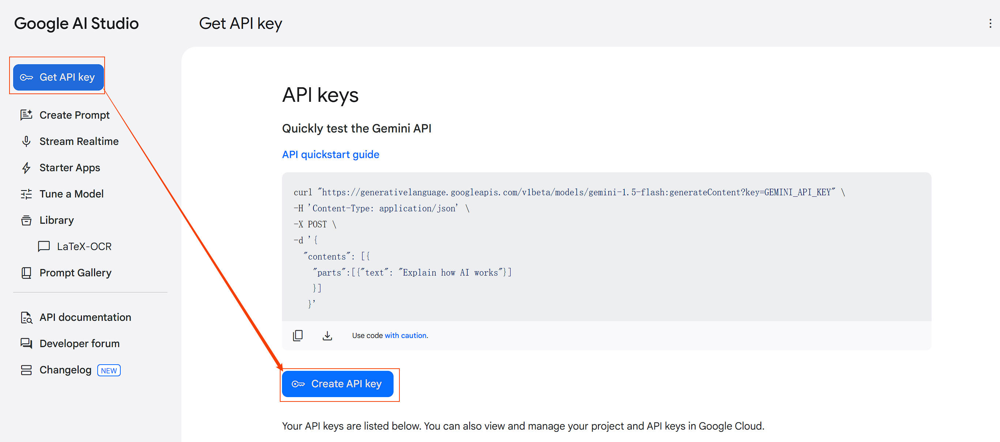

# Gemini-LaTeXOCR

一款基于 Google Gemini 的智能 OCR 工具，通过剪贴板自动识别数学公式并生成精准的 LaTeX/Markdown 代码，助力高效学术笔记。

---

## 📖 简介

为解决复杂数学公式和混合文本的 LaTeX 转换效率问题，本工具基于 **Gemini-2.0-flash** 模型开发。核心优势包括：

- **实时剪贴板监测**：截屏后自动识别（支持开关控制），无需手动操作。
- **高精度识别**：针对数学公式、矩阵、方程组等复杂结构优化。
- **跨格式兼容**：输出代码兼容 `.tex` 和 `.md`，一键复制即可使用。

⚠️ **注意**：  

- 仅支持 **Windows 系统**，需通过科学上网访问 Gemini API。
- 需免费申请 Google AI Studio 的 API Key（[获取指南](#-安装与配置)）。

---

## 🚀 功能特性

- **自动化流程**：剪贴板图像实时监测 → 自动压缩 → 调用 API → 生成代码。
- **双模式输入**：支持剪贴板识别与手动文件上传（PNG/JPG）。
- **智能格式化**：优化代码排版，适配学术写作场景。
- **轻量级程序**：Nuitka 打包，启动时间约 3 秒。

---

## 🔧 安装与配置

### 步骤 1：获取 API Key

1. 访问 [Google AI Studio](https://ai.google.dev/)，登录 Google 账号。
2. 点击「Create API Key」生成密钥
3. 复制生成的密钥备用。


### 步骤 2：运行程序

1. 下载并双击运行 `Gemini-LaTeXOCR.exe`。
2. **首次启动**：粘贴 API Key 至输入框 → 点击「保存」。
3. 重启程序，默认启用剪贴板监测（可通过齿轮图标关闭）。

---

## 🖥 使用方法

### 模式 1：剪贴板识别（推荐）

1. 使用截图工具（如 Snipaste）截取公式/文本区域。
2. 复制图像到剪贴板。
3. 程序自动检测并生成代码，结果显示在主界面。
4. 点击「复制结果」直接粘贴到文档中。

### 模式 2：手动上传

1. 点击「选择文件」按钮，上传本地图像。
2. 等待识别完成，结果自动显示并支持复制。

### 设置选项

- **剪贴板监测**：通过左上角齿轮图标开关此功能。
- **临时文件清理**：程序在每一次识别完成之后会自动删除缓存图像。

---

## 🔍 运行示例

**输入图像**：  


**识别输出**：

```latex
定理5 如果齐次线性方程组
$$
\begin{cases}
a_{11}x_1 + a_{12}x_2 + \dots + a_{1n}x_n = 0, \\
a_{21}x_1 + a_{22}x_2 + \dots + a_{2n}x_n = 0, \\
\vdots \\
a_{n1}x_1 + a_{n2}x_2 + \dots + a_{nn}x_n = 0
\end{cases}
$$
的系数矩阵的行列式 \(|A| \neq 0\)，那么它只有零解。  
```


---

## 📜 版本历史

| 版本     | 日期       | 更新内容                                                     |
| -------- | ---------- | ------------------------------------------------------------ |
| **v1.1** | 2025/03/02 | 迁移至 PyQt6 框架，优化界面稳定性；新增一键复制功能；支持 Markdown 兼容。 |
| **v1.0** | 2025/02/12 | 初版发布：API 调用、剪贴板监测、图像压缩与临时文件管理。     |

---

## ❓ 常见问题

1. **必须科学上网吗？**  
   是，调用 Gemini API 需全局代理访问 Google 服务，推荐使用稳定工具。

2. **支持识别手写公式吗？**  
   目前针对印刷体公式优化，手写体识别精度可能较低。

3. **如何提高识别速度？**  
   确保网络通畅，图像区域尽量仅包含公式（减少无关内容）。

4. **会保存我的 API Key 吗？**  
   API Key 仅储存在本地配置文件中，不会上传至服务器。

---

## 📄 开源协议

本项目基于 MIT 协议开源，更多细节请查看 [LICENSE](LICENSE) 文件。  
如有问题或建议，请联系：📧 w_zilin@outlook.com
